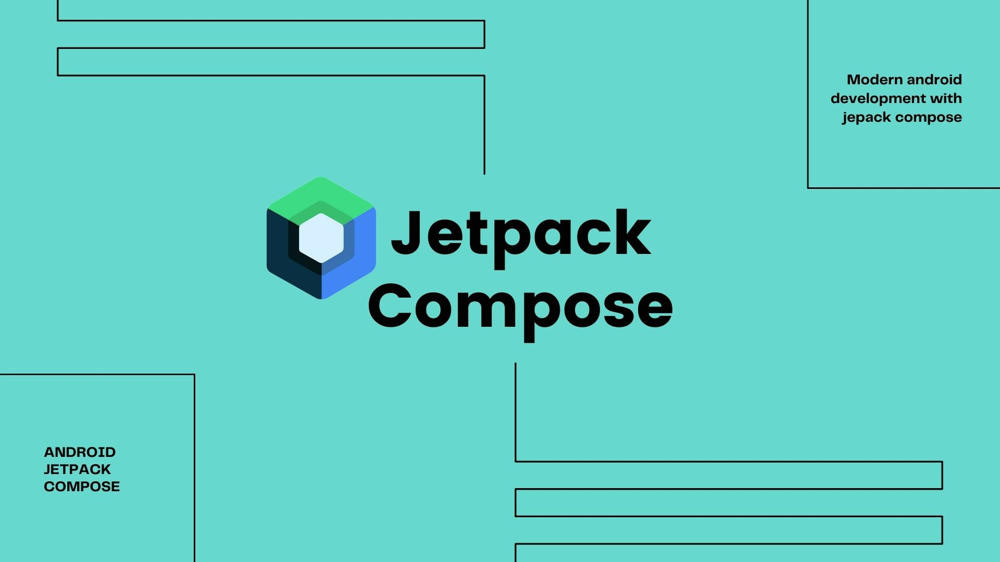
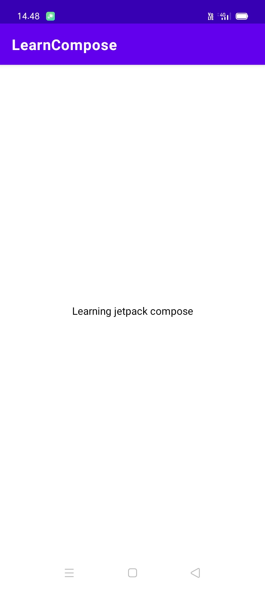
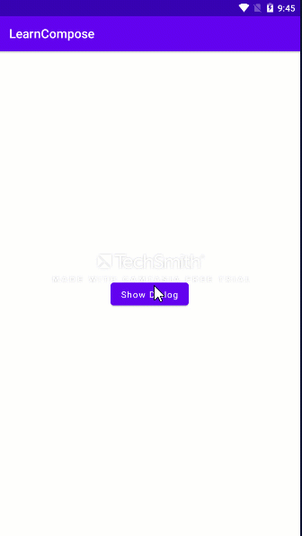
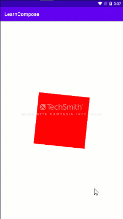
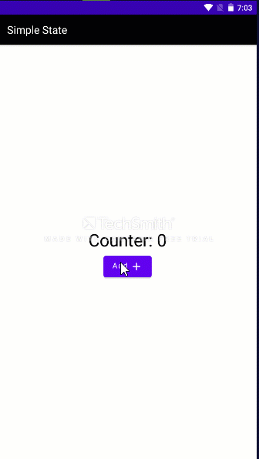

# Learn  🚀 Jetpack Compose
 
###

###
Repository for examples to learn jetpack compose

|Example|Preview|
|-------|-------|
|[How do display text on the screen using Jetpack Compose?](https://github.com/vinaygaba/Learn-Jetpack-Compose-By-Example/blob/master/app/src/main/java/com/example/jetpackcompose/text/SimpleTextActivity.kt)| |
|[Make Alert Dialog in Jetpack Compose ](https://github.com/vinaygaba/Learn-Jetpack-Compose-By-Example/blob/master/app/src/main/java/com/example/jetpackcompose/material/AlertDialog.kt)| |
|[Animating your components in Jetpack Compose ](https://github.com/vinaygaba/Learn-Jetpack-Compose-By-Example/blob/master/app/src/main/java/com/example/jetpackcompose/animation/Animation1Act.kt)| |
#
## State Management

State management in jetpack compose is so easy. In my opinion, like as Bloc in flutter. Because we must stream value in livedata

|Example|Preview|
|-------|-------|
|[Simply managing state in jetpack compose (Statful composable)](https://github.com/vinaygaba/Learn-Jetpack-Compose-By-Example/blob/master/app/src/main/java/com/example/jetpackcompose/state/SimpleState.kt)| |

License
-----------------

                         GNU GENERAL PUBLIC LICENSE
                          Version 3, 29 June 2007

         Copyright (C) 2007 Free Software Foundation, Inc. <https://fsf.org/>
         Everyone is permitted to copy and distribute verbatim copies
         of this license document, but changing it is not allowed.

                                    Preamble

          The GNU General Public License is a free, copyleft license for
        software and other kinds of works.

          The licenses for most software and other practical works are designed
        to take away your freedom to share and change the works.  By contrast,
        the GNU General Public License is intended to guarantee your freedom to
        share and change all versions of a program--to make sure it remains free
        software for all its users.  We, the Free Software Foundation, use the
        GNU General Public License for most of our software; it applies also to
        any other work released this way by its authors.  You can apply it to
        your programs, too.
